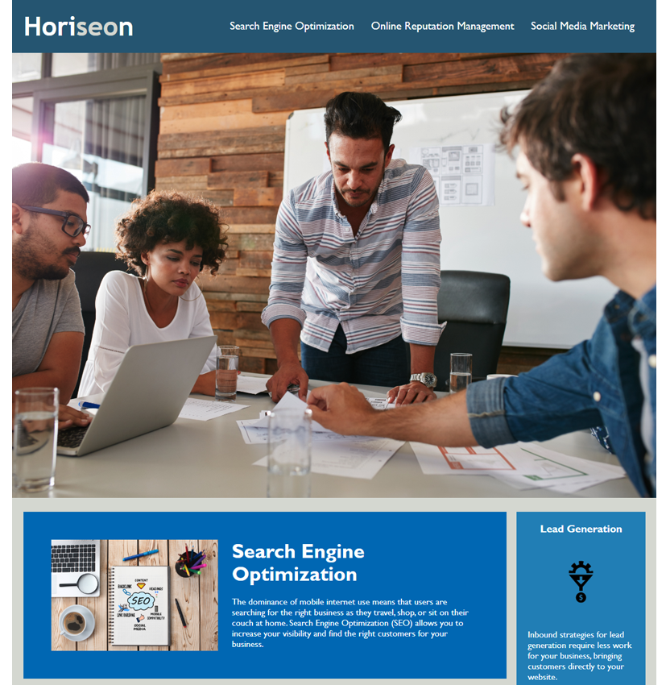

# CodeRefactorHW

## Description

This was an assignment to update a companies (Horiseon) webpage to ensure proper accessibility. Updates to html file structure to include proper semantics were included. Also, css selector consolidation was completed.

## Installation

No installation specification needed.

## Usage

Path to screen shot of application.
 `

## Credits

I consulted www.w3schools.com for tutorials on semantic elements.
